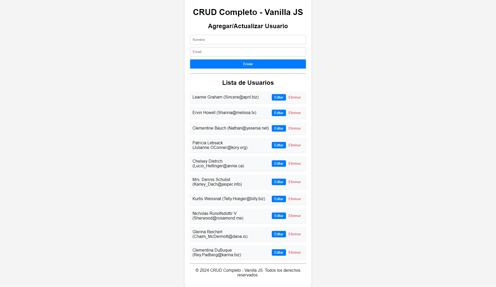

# CRUD Completo - Vanilla JS 🚀

Este es un proyecto de aplicación CRUD (Crear, Leer, Actualizar, Eliminar) construido con JavaScript puro (Vanilla JS) y Vite. La aplicación permite gestionar una lista de usuarios utilizando la API pública de JSONPlaceholder.

<p align="center">
  
</p>

## Características ✨

- **Agregar usuarios**: Permite crear nuevos usuarios.
- **Listar usuarios**: Muestra todos los usuarios en una lista.
- **Actualizar usuarios**: Permite editar la información de los usuarios existentes.
- **Eliminar usuarios**: Permite eliminar usuarios de la lista.

## Tecnologías Utilizadas 🛠️


## Instalación 📦

1. Clona el repositorio:
   ```bash
   git clone https://github.com/israelinxy/crud-completo-vanilla-js.git
   ```

2. Navega al directorio del proyecto:
   ```bash
   cd crud-completo-vanilla-js
   ```

3. Instala las dependencias utilizando npm:
   ```bash
   npm install
   ```

4. Inicia el servidor de desarrollo:
   ```bash
   npm run dev
   ```

5. Abre tu navegador y visita `http://localhost:3000` para ver la aplicación en funcionamiento.

## Uso 🖥️

1. Al abrir la aplicación, verás un formulario para agregar o actualizar usuarios.
2. Ingresa el nombre y el correo electrónico del usuario y haz clic en "Enviar" para agregarlo a la lista.
3. La lista de usuarios se mostrará debajo del formulario.
4. Puedes editar un usuario haciendo clic en el botón "Editar" junto a su nombre.
5. Para eliminar un usuario, haz clic en el botón "Eliminar".

## Estructura del Proyecto 📁

```
/tu_repositorio
│
└── public/
    ├── src/
    │   ├── api.js        # Lógica para interactuar con la API
    │   ├── crud.js       # Lógica del CRUD y manipulación del DOM
    │   ├── styles.css     # Estilos CSS para la aplicación
    │   └── main.js       # Punto de entrada de la aplicación
    ├── index.html        # Archivo HTML principal
    └── README.md         # Este archivo

```

## Licencia 📜

Este proyecto está bajo la licencia [MIT](LICENSE).
